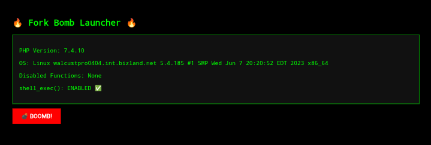

# 💣 ForkBomber — PHP Fork Bomb Launcher

> ⚠️ DISCLAIMER: This project is for **educational and research purposes only**.  
> Do NOT run this script on shared hosting or any production server.  
> You are fully responsible for your actions.

---

## 🧠 About

**ForkBomber** is a simple web-based PHP tool.  
It spawns multiple PHP CLI infinite loops (`while(1){}`) via `shell_exec()`  
and includes a **PANIC button** to attempt cleanup via `pkill`.

---

## ⚙️ Features

- 💥 Trigger fork bomb (`?boom=1`)
- 🧹 PANIC button to stop all forked PHP CLI processes
- ✅ Checks for `shell_exec()` availability
- 💻 Shows PHP version, OS, and disabled functions
- 🔁 Animated terminal-style fake output

---

## 🔐 Requirements

- PHP with `shell_exec()` enabled
- Access to shell commands (`php`, `pkill`)
- VPS or local server (not for shared hosting!)

---

## 🚀 Usage

1. Upload `index.php` to your web-accessible directory.
2. Open in browser:  
   `http://your-server/index.php`
3. Click **💣 BOOMB!** to trigger fork bomb.
4. If your CPU survives, click **🆘 PANIK** to clean up.

---

## 📸 Preview

---

## 📛 Warnings

- This will **drain your CPU** rapidly.
- PANIC button may not work without root/sufficient permissions.
- Do not use on shared/public systems.
- Use in sandboxed environments only.

---

## 📄 License

This project is licensed under the MIT License — see [LICENSE](LICENSE) for details.

---

## 💻 Author

Coded with 💀 by [0x6ick](https://github.com/6ickzone)
